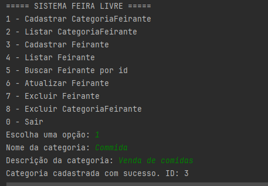
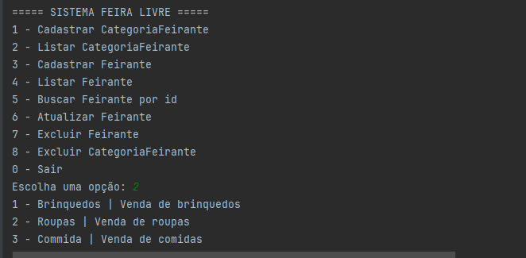
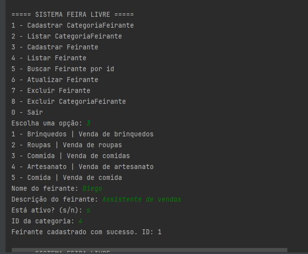
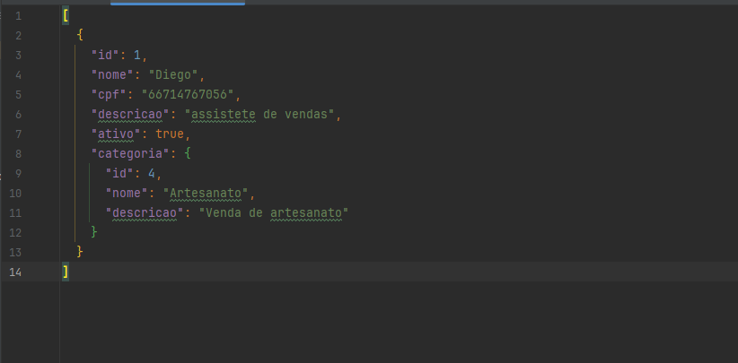

# CRUD Feira Livre - GRASP
##De: Guilherme Machado e Pedro Henrique Amaral

## Como executar

1. Abrir projeto no IntelliJ
2. Executar a classe Main.java
3. Interagir pelo menu no terminal

## Funcionalidades

- Cadastro de CategoriaFeirante
- Cadastro de Feirante
- Listagem
- Busca por ID
- Atualização
- Remoção
- Persistência em JSON

## Aplicação dos padrões GRASP

- Information Expert:
As validações estão nas próprias entidades (Feirante e CategoriaFeirante).

- Creator:
Os serviços são responsáveis por criar as entidades.

- Controller:
A classe FeiraController recebe as entradas do usuário.

- Low Coupling:
O domínio não depende da persistência.

- High Cohesion:
Cada classe tem responsabilidade bem definida.

- Indirection:
Uso de interfaces de repositório.

- Protected Variations:
A troca de persistência não afeta o restante do sistema.

## Evidências de execução

### Cadastro de CategoriaFeirante

### Listar Categorias

### Cadastro de Feirante

### JSON de Feirante

## Observação

Persistência implementada manualmente em JSON sem uso de bibliotecas externas.
